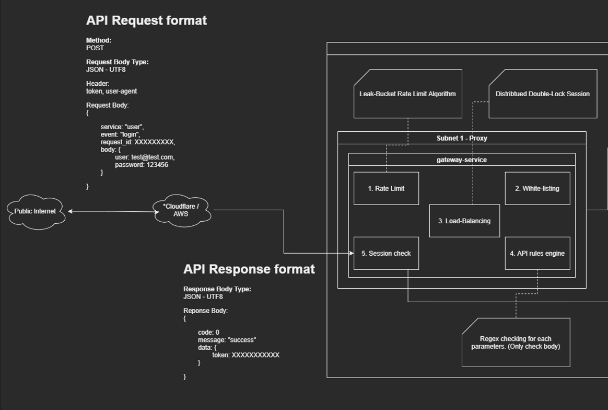

# API Gateway on NodeJS


### 0. Features
- API Rules Engine
- Distributed Load-Balancing Algorithms
- Support Microservices Architecture
- Asymmetric JWT Double-Lock Session
- Rate-Limit Components
- Http API Proxy Gateway
- Support Single Redis Instance

### 1. Environment Construction
- node 10
- yarn

### 2. Dependencies install
*  `yarn install`
    or
*  `npm install`


### 3. Construct image
#### Dependency
- docker environment
- Directly user `pm2 start pm2.json --env local > /dev/null` in local dev environment
- `pm2 kill` - kill all services

#### Write dockerfile
````
FROM keymetrics/pm2:10-alpine

# Create app directory
RUN mkdir -p /usr/src/app
WORKDIR /usr/src/app
ADD . /usr/src/app
EXPOSE 3005
CMD pm2-runtime start pm2.json --no-autorestart --env $ENV_NAME
````
#### Construct docker image
`docker build -t apigateway-service:latest .` Construct the name - apigateway-service:latest as image

#### Run on Docker
* Example： 
```

General Installation (Without Docker):

    1. `cd` in to the project's home directory and enter `yarn install`.
    2. Once the packages have installed, open up the project from your text editor of choice.
    3. Configurue the Redis connection by system-config.json
    4. From the terminal, enter `npm start`. The app should (hopefully) fire right up.
    5. pm2 start -i 2 pm2.json --env dev

Dockerization:

    Dockerfile:

        FROM node:10.12
        # Create app directory
        RUN mkdir -p /usr/src/app
        WORKDIR /usr/src/app
        # Install app dependencies
        COPY . ./
        RUN yarn install
        # Bundle app source
        RUN yarn global add pm2
        RUN npm install
        CMD ["cd", "/usr/src/app"]
        CMD pm2-runtime start pm2.json --no-autorestart --env local
    
    Build and Run:

        aa=`docker stop apigateway-service`
        echo $aa
        bb=`docker rm apigateway-service`
        echo $bb
        ca=`docker rmi apigateway-service`
        echo $ca
        b=`docker build -t apigateway-service .`
        echo $b
        docker run -d  -p 3005:3005 --name apigateway-service --restart=always apigateway-service;docker logs -f apigateway-service
